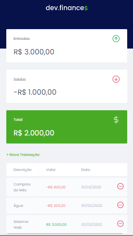

<h3 align="center">
    
    <br><br>
    <b> Plataforma de Financias Pessoais!</b>  
    <br>
</h3>


# Índice

- [Sobre](#sobre)
- [Tecnologias Utilizadas](#tecnologias-utilizadas)
- [Como Usar](#como-usar)
- [Como Contribuir](#como-contribuir)

<a id="sobre"></a>


## :bookmark: Sobre

	
O <strong>dev.finance$</strong> é uma aplicação Web e Mobile que gerencia as contas pessoais durante o mês, a uxilia os usuarios no controle de seus gastos mensais trazendo um lista de entrada e saida de dinheiro.

Essa aplicação foi construída na trilha <strong>Maratona Discover </strong> e  distribuída pela [Rocketseat](https://rocketseat.com.br/). A ideia de criar uma aplicação voltada para gerenciamento de Financias pessoais surgiu da necessidade de usuarios ter controle de seus gastos mensais.

<br>


<a id="tecnologias-utilizadas"></a>

## :rocket: Tecnologias Utilizadas

O projeto foi desenvolvido utilizando as seguintes tecnologias

- [Html](https://developer.mozilla.org/pt-BR/docs/Aprender/HTML/Introducao_ao_HTML)
- [JavaScript](https://developer.mozilla.org/pt-BR/docs/Web/JavaScript)
- [css](https://developer.mozilla.org/pt-BR/docs/Web/CSS)


## :heavy_check_mark: :computer: Prototipo da Aplicação

- O layout está disponível no **[Figma](https://www.figma.com/file/yWHLd1NjaTnRdV79gEorj4/dev.finance-Maratona-Discover-Copy)**;


## :heavy_check_mark: :computer: Resultado Web

<h1 align="center">
    
</h1>

</br>

## :heavy_check_mark: :computer: Resultado Mobile

<h1 align="center">
    
</h1>
</br>

<a id="como-usar"></a>

## :fire: Como usar


1. Faça um clone :

```sh
  $ git clone https://github.com/Rafael-Rufino/Dev.finance.git

```

2. Executando a Aplicação:

```sh

  # Inicie a aplicação web
  $ Instalar a extensão Live server
  # Execute com Live server
  $ Maratona-discover/public/src/html/index.html

  
  # Acessar o Servidor no Navegador
  $ http://127.0.0.1:3000/
 
  # Porta de Acesso Liberado
  $ 3000


```


## :recycle: Como contribuir

- Faça um Fork desse repositório,
- Crie uma branch com a sua feature: `git checkout -b my-feature`
- Commit suas mudanças: `git commit -m 'feat: My new feature'`
- Push a sua branch: `git push origin my-feature`


🎓 **Quem ministrou?**

As aulas foram ministradas pelo mestre Mayk Brito - Instructor - Rocketseat nas aulas do Maratona Discover.

📝 **License**

Esse projeto está sob a licença MIT. Veja o arquivo [LICENSE](LICENSE.md) para mais detalhes.


<h4 align="center">
    Feito com 💜 by <a href="https://www.linkedin.com/in/rafael-r-dos-santos-b889311ba/" target="_blank">Rafael Rufino</a>
</h4>


